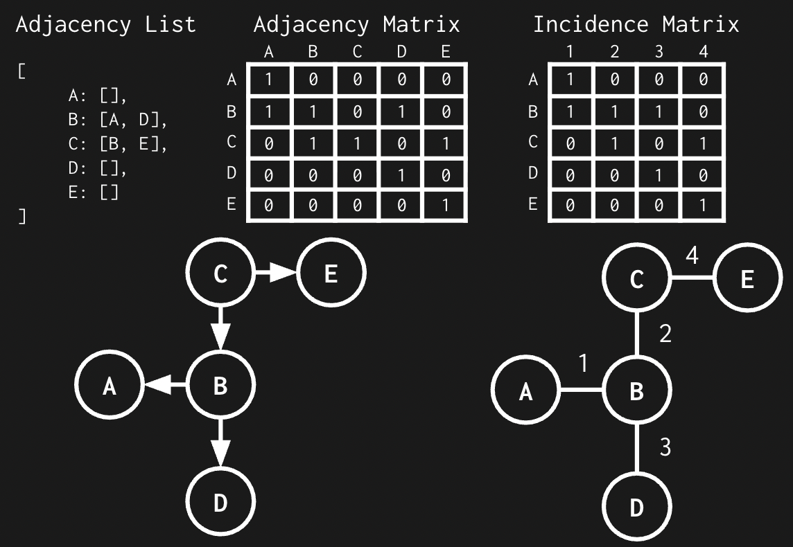
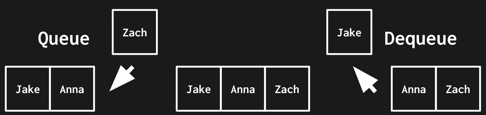

# Data Structures

## Arrays / Strings
Contiguous block of memory for storing elements.  
Access: O(1), instant access using starting address + index.  
Insert/Delete: O(n), requires shifting elements.

## Linked Lists
Nodes containing an element and a pointer to the next value.  
Access: O(n), requires traversing the list.  
Insert/Delete: O(1), if you have a pointer to node in the correct position.

## Trees
Hierarchical nodes with pointers to two or more child nodes.  
Root nodes have no incoming pointers.  
Leaf nodes have no outgoing pointers.  
Operations, height-balanced: O(n log n)  
Operations, degenerate: O(n)

## Graphs
Nodes connected by directed or undirected edges.  
Graphs are represented in three ways.  
An Adjacency List is a list of nodes with information on the nodes it is connected to.   
&nbsp;Good for sparse graphs.   
&nbsp;Slower edge checks/removals.  
An Adjacency Matrix is a matrix where the value at index (i, j) indicates whether an edge exists from i to j.   
&nbsp;Good for dense graphs and frequent edge checks/mutations.   
&nbsp;High memory overhead.  
An Incidence Matrix is a matrix where the rows represent nodes and the columns represent edges where the value at index (i, j) indicates whether node i is touched by edge j.  
&nbsp;Memory efficent and fast edge checks/mutations with sparse graphs.

|                  | Adjacency List | Adjacency Matrix | Incidence Matrix |
|------------------|----------------|------------------|------------------|
| Store graph      | O(\|V\|+\|E\|) | O(\|V\|²)        | O(\|V\|⋅\|E\|)   |
| Add vertex       | O(1)           | O(\|V\|²)        | O(\|V\|⋅\|E\|)   |
| Add edge         | O(1)           | O(1)             | O(\|V\|⋅\|E\|)   |
| Remove vertex    | O(\|E\|)       | O(\|V\|²)        | O(\|V\|⋅\|E\|)   |
| Remove edge      | O(\|V\|)       | O(1)             | O(\|V\|⋅\|E\|)   |

V = # of Verticies  
E = # of Edges

## Stack / Queue
Stacks are last in first out (LIFO). Think of a stack of plates, the last plate you put on the stack is the first one you take off.  
Queues are first in first out (FIFO). Think of a queue of people waiting in line, the first person in line is the first person to get out of line.  
Operations: O(1) push/pop/enqueue/dequeue.

  

## Hash Maps
Key-value pairs where the key is hashed to an index in an array.  
Average: O(1) access/insert/delete.

